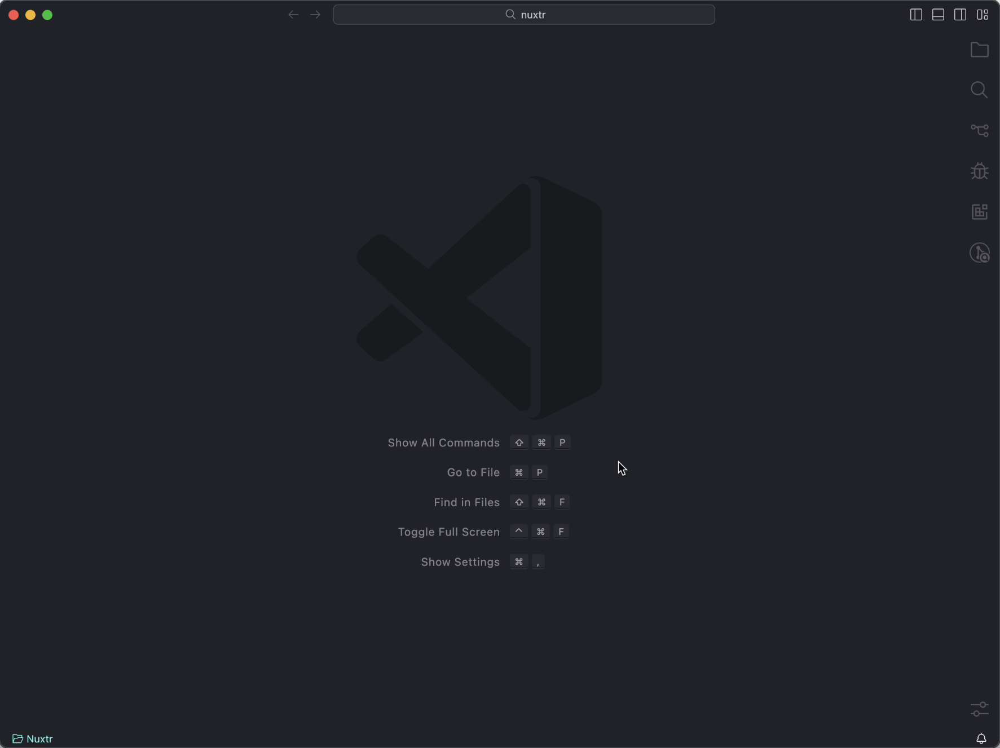
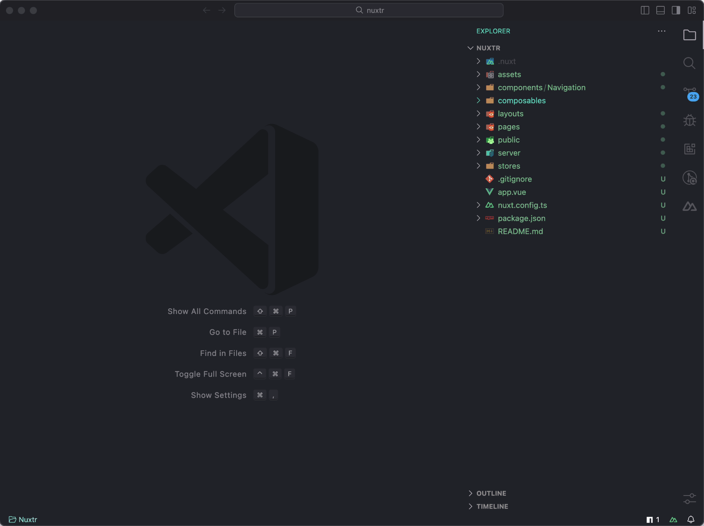
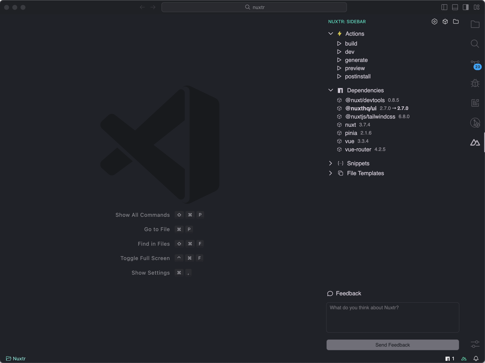
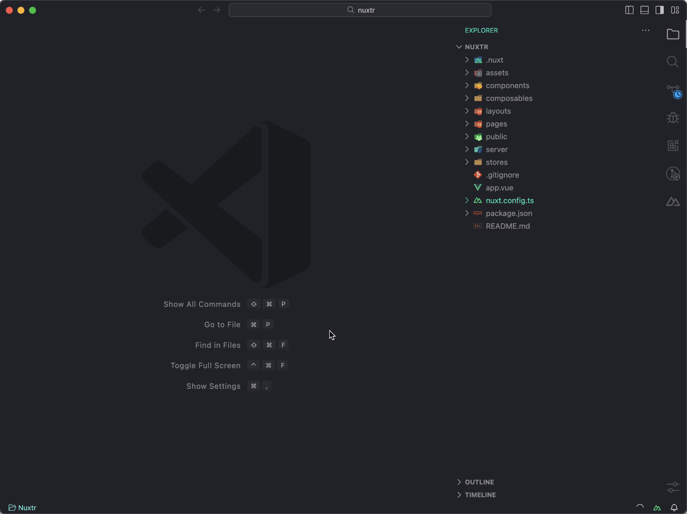
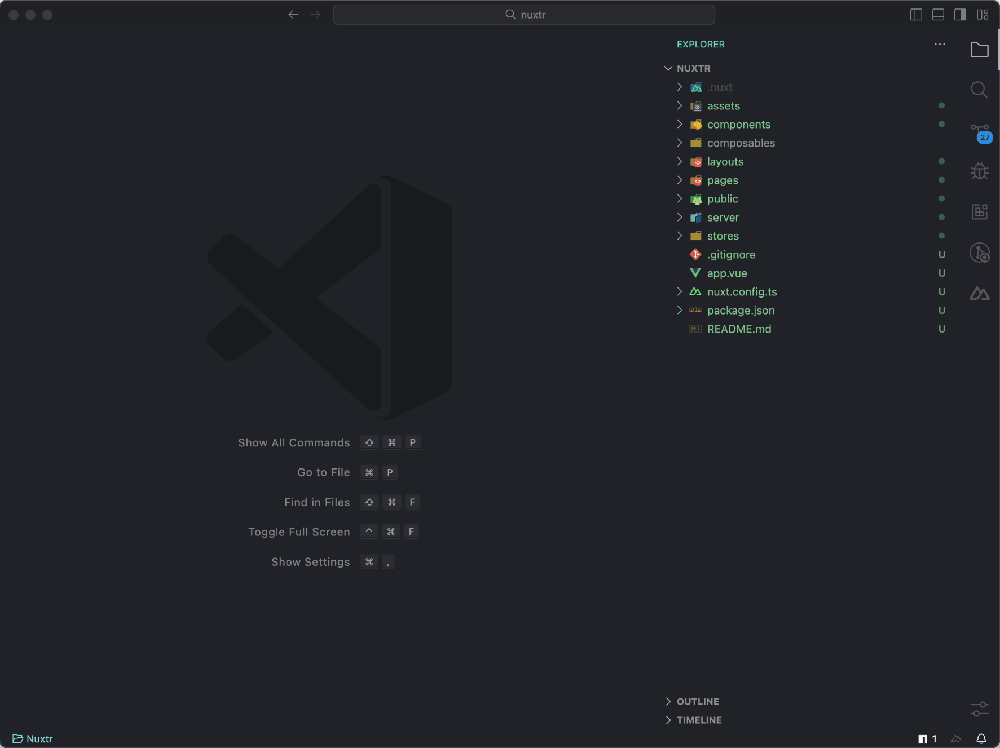

<br />

<div align="center">
    
    <h3 align="center">Nuxtr VSCode</h3>
    <p align="center">An extension offering commands and tools <br /> to make your experience with Nuxt more pleasant!</p>
    <div align="center">
        <a href="https://marketplace.visualstudio.com/items?itemName=Nuxtr.nuxtr-vscode" target="_blank"></a>
        <a href="https://marketplace.visualstudio.com/items?itemName=Nuxtr.nuxtr-vscode" target="_blank"></a>
    </div>
    <br>
    <div align="center">
        <a target="_blank" href="https://github.com/nuxtrdev/nuxtr-vscode/issues/new?assignees=&labels=bug%2Ctriage&projects=&template=issue.yaml&title=%5BBug%5D%3A+"><strong>Report Bug</strong> »</a>
        ·
        <a target="_blank" href="https://github.com/nuxtrdev/nuxtr-vscode/discussions/new/choose"><strong>Share Idea/feedback</strong> »</a>
    </div>
</div>


<br>

### What does Nuxtr do?

- [Directory and File Creation](#directory-and-file-creation)
- [Dependencies management](#dependencies-management)
- [IntelliSense and Auto Completion](#intellisense-and-auto-completion)
- [Nuxi CLI Integration](#nuxi-cli-integration)
- [Nuxt, Nitro and Custom Snippets](#nuxt-nitro-and-custom-snippets)
- [Personalized Vue File Templates](#personalized-vue-file-templates)
- [Support for `srcDir`, `serverDir`, and Monorepo Projects](#support-for-srcdir-serverdir-and-monorepo-projects)
- [Execute Scripts with Ease](#execute-scripts-with-ease)
- [Toggle Nuxt Devtools from your status bar](#toggle-nuxt-devtools-from-your-status-bar)
- [Search and install Nuxt integrations](#search-and-install-nuxt-integrations)
- [Install \& Configure CSS frameworks and Linters](#install--configure-css-frameworks-and-linters)

<br>
<br>

### Directory and File Creation

Effortlessly generate all essential directories and files for your Nuxt project right from within VSCode. Utilize the command palette  or context menus to swiftly create Vue/TypeScript files, as well as special files like [`.nuxtignore`](https://nuxt.com/docs/guide/directory-structure/nuxtignore), [`.nuxtrc`](https://nuxt.com/docs/api/configuration/nuxt-config), and [`app.config.ts`](https://nuxt.com/docs/guide/directory-structure/app-config).

To initiate any creation action, simply prepend it with the prefix **`Nuxtr: Create...`** and **`Nuxtr: Nuxt project structure...`** command for creating the entire project structure.

Customize Vue file templates with these settings:

```JSON
"vueFiles.template.defaultLanguage": "html",
"nuxtr.vueFiles.firstTag": "template",
"nuxtr.vueFiles.script.type": "setup",
"nuxtr.vueFiles.script.defaultLanguage": "ts",
"nuxtr.vueFiles.style.addStyleTag": true,
"nuxtr.vueFiles.style.alwaysScoped": true,
"nuxtr.vueFiles.style.defaultLanguage": "scss",
"nuxtr.piniaFiles.defaultTemplate": "options"
```

Additionally, you can choose to automatically open the newly created file with:

```JSON
"nuxtr.openItemsAfterCreation": true
```


<br>
<br>

### Dependencies management

**Package Manager Detection**: Your package manager is automatically detected if a lock file exists. Alternatively, you can specify which package manager to use with the following setting:

```JSON
"nuxtr.defaultPackageManager": "pnpm"
```

**Dependencies Management**: Within the sidebar of the project view, easily remove, upgrade, or downgrade your dependencies by selecting the desired version.

**Status Bar Icon**: Keep an eye on your outdated dependencies directly from the status bar. With just a few clicks, you can initiate the update process.

<br>



<br>
<br>

### IntelliSense and Auto Completion

Nuxtr VSCode offers robust IntelliSense capabilities tailored for Vue files. This includes dynamic path completion for [NuxtLinks](https://nuxt.com/docs/api/components/nuxt-link#internal-routing) within the pages directory, and seamless handling of media resources from the [public or static directories](https://nuxt.com/docs/guide/directory-structure/public), depending on your Nuxt version. Additionally, enjoy IntelliSense support for critical configuration files like [`.nuxtignore`](https://nuxt.com/docs/guide/directory-structure/nuxtignore) and [`.nuxtrc`](https://nuxt.com/docs/guide/directory-structure/nuxtrc), ensuring precise guidance and efficient coding.

You can enable/disable IntelliSense from the settings:

```JSON
 "nuxtr.intellisense.nuxtrc": true,
 "nuxtr.intellisense.vueFiles": true,
 "nuxtr.intellisense.nuxtignore": true,
```



<br>
<br>

### Nuxi CLI Integration

The Nuxt CLI, also known as [Nuxi](https://github.com/nuxt/cli), is an essential tool for every Nuxt developer. Seamlessly integrated into Nuxtr, it enables you to effortlessly execute Nuxi commands directly from the command palette. Under the `Nuxtr: Run` prefix, you'll discover a curated set of frequently used commands at your fingertips. Additionally, you can access the complete list of Nuxi commands through the `Nuxtr: Nuxi CLI` command.

While using the CLI directly from your terminal is perfectly viable, Nuxtr's integration enhances your development experience, especially when working with multiple terminals. It introduces a structured approach to your terminal environment, categorizing commands based on their scope. This not only streamlines your workflow but also simplifies the process of adding modules, eliminating the need to recall or search for exact names.




<br>
<br>

### Nuxt, Nitro and Custom Snippets

**Nuxt Snippets**: Enhance your development speed with Nuxt snippets. Simply type `nuxt` for components, `use` for Composables, or begin typing Nuxt utilities and select your desired snippet from the list.

Starting 0.2.10, you can inject a dynamic snippet based on your Nuxtr Vue files configuration with `vueBaseFile` or `vueBaseLayout`.

Nuxt Snippets are enabled by default. You can toggle them on or off using this setting:

```JSON
 "nuxtr.snippets.nuxt": true
```

**Nitro Snippets**: Nitro powers the Nuxt Server Engine. For detailed information, refer to the [Nitro Docs](https://nitro.unjs.io).

Nitro Snippets are enabled by default. You can customize their behavior using this setting:

```JSON
 "nuxtr.snippets.nitro": true
```

**Custom Snippets**: Easily manage your custom snippets directly from the sidebar. Create, edit, or delete your snippets with ease. Stay tuned for more updates on this feature!

<br>
<br>

### Personalized Vue File Templates

In order to offer users greater flexibility in tailoring their Vue files, we provide the capability to create and utilize personalized templates. These templates can be set as defaults or used selectively based on the user's preference.

We currently support two types of templates to ensure a consistent user experience: `.page-template` and `.layout-template`. When Nuxt is loaded, these files are treated as regular Vue files, simplifying the editing process. Templates can be created from existing respective files via the context menu or from empty templates accessed in the sidebar.

Set your default template with these settings:

```JSON
"nuxtr.vueFiles.pages.defaultTemplate": "default.page-template",
"nuxtr.vueFiles.layouts.defaultTemplate": "default.layout-template"
```


<br>
<br>

### Support for `srcDir`, `serverDir`, and Monorepo Projects

> **Note:** Monorepo mode is under heavy development.

Nuxtr seamlessly integrates with projects using `srcDir` and `serverDir`, as well as monorepo setups. Set your `srcDir` or `serverDir` directly from your `nuxt.config.ts` file, and Nuxtr will detect and generate files/directories in the correct locations for you.

Example:

```JSON
  "srcDir": "src",
  "serverDir": "server"
```

For monorepo configurations, specify the directory name containing your Nuxt project in your `.vscode/settings.json`:

```JSON
  "nuxtr.monorepoMode.DirectoryName": "directory-name"
```

<br>
<br>

### Execute Scripts with Ease

Access main scripts directly from the command palette for swift execution. Should you require a custom command, you can conveniently locate it in the sidebar. With the exception of nuxt dev, all other commands operate in the background, and you can monitor the output in the VSCode output channel.


<br>
<br>

### Toggle Nuxt Devtools from your status bar

[Nuxt Devtools](https://devtools.nuxtjs.org/) empowers you to make informed decisions about your project. Provides invaluable insights and transparency for your Nuxt application. Uncover performance gaps and effortlessly fine-tune your app configurations and more!

 Nuxtr offers a toggle directly in your VSCode statusbar. Manual toggling from nuxt.config.ts is also detected and state is synced.



<br>
<br>

### Search and install Nuxt integrations

Effortlessly search for and install Nuxt modules, mirroring the familiar experience of the [Nuxt Modules](https://nuxt.com/modules) directory. Once you've located your desired module and your package manager is detected, it will be seamlessly integrated into your nuxt.config file. A success message will confirm the installation, along with a quick link to access the module documentation.


Search and Install Nuxt modules with a typical searching/filters experience as [Nuxt Modules](https://nuxt.com/modules) directory. Once you have found your desired module and your package manager is detected, it will be installed and added to the nuxt.config file. A success message will be displayed, along with a button to access the module documentation.

Starting from v0.1.0, you can filter integration types (modules/layers) from the sidebar.



<br>
<br>

### Install & Configure CSS frameworks and Linters

You can install and configure most CSS frameworks with few steps:

- Tailwind CSS.
- UnoCSS.
- WindiCSS (RIP).
- Vueitfy.

Same for linters:

- Stylelint.
- Eslint.

More coming soon.


<br>

### Contributing

We always welcome new ideas! 💚 <br>
If you have any idea, feel free to [open a discussion](https://github.com/orgs/nuxtrdev/discussions/new?category=ideas) first and let's talk about it!

<br>

### Acknowledgements

Nuxtr VSCode relies on the following projects/repositories:

- [Nuxt Modules](https://github.com/nuxt/modules)
- [Nuxt Assets](https://github.com/nuxt/assets)
- [Tabler Icons](https://tablericons.com/)

<br>

### License

[MIT](https://github.com/nuxtrdev/nuxtr-vscode/blob/main/LICENSE) License © 2023 with 💚
